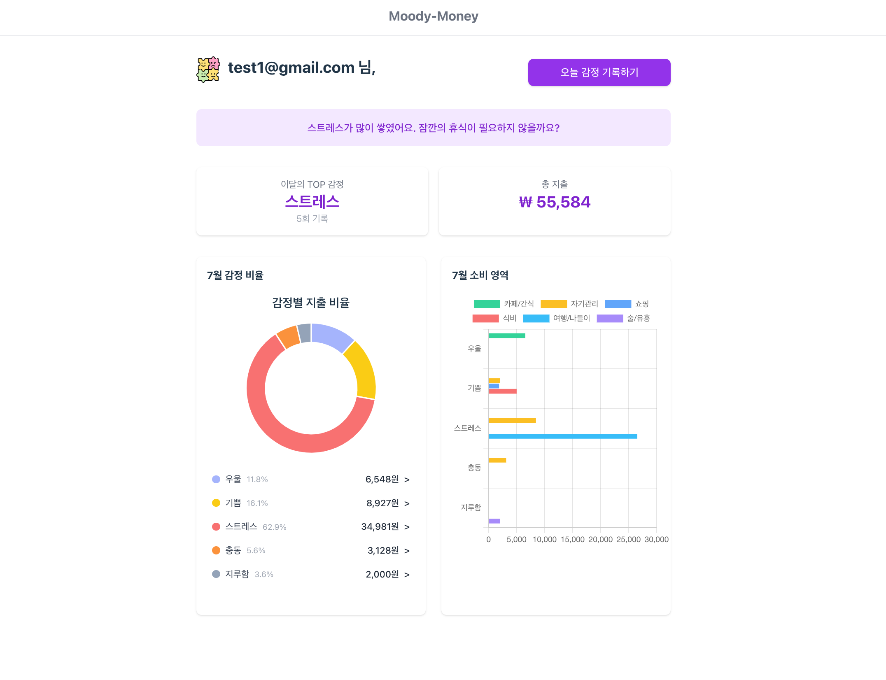
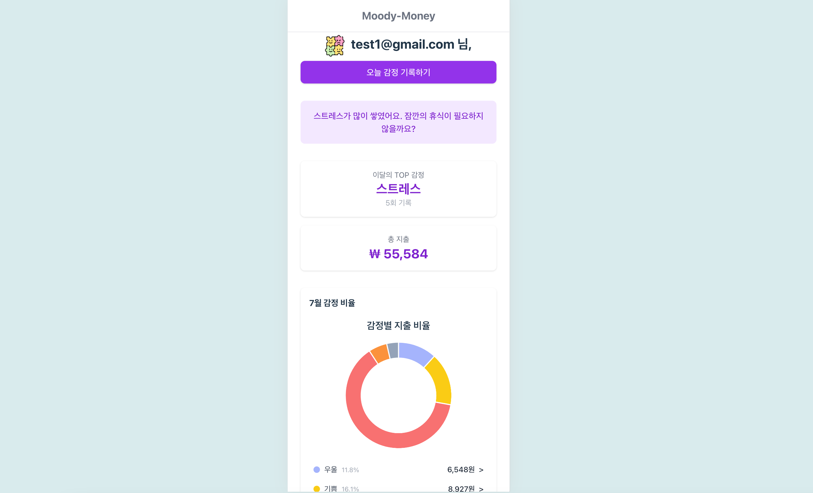
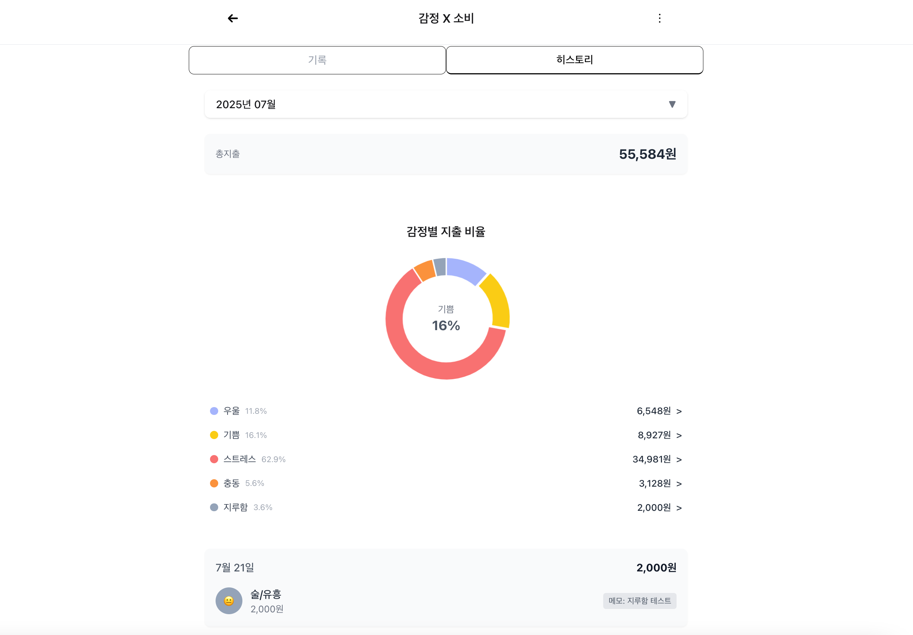
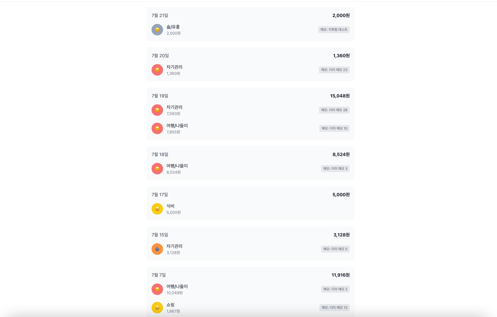

# Moody-Money 감정 기반 가계부

https://moody-money.vercel.app/

> 감정과 소비 데이터를 기록하고 시각화하는 개인용 기록 공간  
> **"오늘 나는 왜 지출했을까?"** 감정 기록으로 소비 패턴을 분석하세요.

---

## 📌 프로젝트 소개

“moody-money" 는 단순 지출 입력이 아니라 ‘왜 지출이 발생했는가’ 에 대해 되돌아보는데 도움을 주는 자기 관리 앱입니다.

감정상태와 소비를 함께 기록함으로써 자신만의 감정-소비 패턴을 시각적으로 인식하는데 도움을 줄 수 있습니다.

---

## 📌 주요 기능

[지출기록 + 감정태깅 → 시각화 차트 분석]

- **대시보드 분석**:
  - 감정별 비율 Pie Chart
  - 카테고리별 감정 소비 Bar Chart
- **핵심 인사이트 메시지**: "이번 달 당신의 감정은 ○○"
- **감정 + 지출 기록**: 오늘의 소비와 감정을 쉽게 기록
- **히스토리 뷰**: 월별 데이터 탐색, 감정별 기록 리스트

---

## 🛠 기술 스택

- React + Vite, TypeScript, TailwindCSS
- Zustand (+ persist)
- Firebase: Authentication, Firestore
- Charts: Chart.js + react-chartjs-2
- Animation: Framer Motion

---

## 📌 프젝젝트 구조

```
/src
├── components
|   ├── common/
│   |   ├── EmotionLayout.tsx
│   |   ├── Header.tsx
|   |
|   ├── dashboard/
│   |   ├── TopEmotionCard.tsx
│   |   ├── TotalExpenseCard.tsx
|   |
|   ├── CategorySelector.tsx
|   ├── MonthSelector.tsx
|   |
│   ├── EmotionSelector.tsx
│   ├── EmotionList.tsx
|   ├── EmotionPieChart.tsx
│   └── EmotionBarChart.tsx
│
├── pages
│   ├── Login.tsx
│   ├── SignUp.tsx
│   ├── Dashboard.tsx
│   ├── EmotionRecord.tsx     // 감정, 지출 기록
│   └── EmotionHistory.tsx    // 기록 내역 , 차트분석
|
|__ utils
|     ├── computeBarMatrix.ts
|     ├── computePieChart.ts
|     └── seedFirestore.ts
|           .
|           .
|
|__ constants
|     ├── emotion.ts
│     └── categories.ts
```

---

## 페이지 상세

### 대시보드



### 대시보드-모바일



### 감정소비 기록


### 감정소비 히스토리



### 감정소비 리스트


